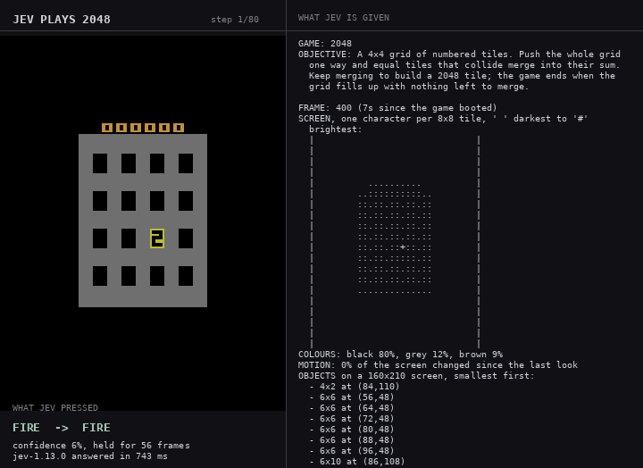
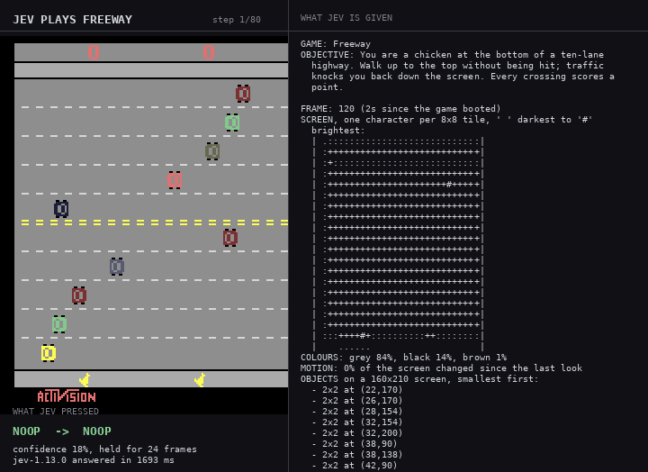
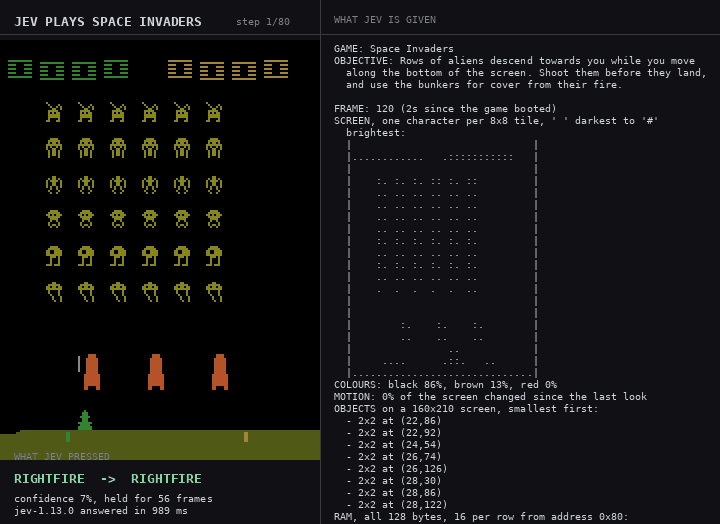
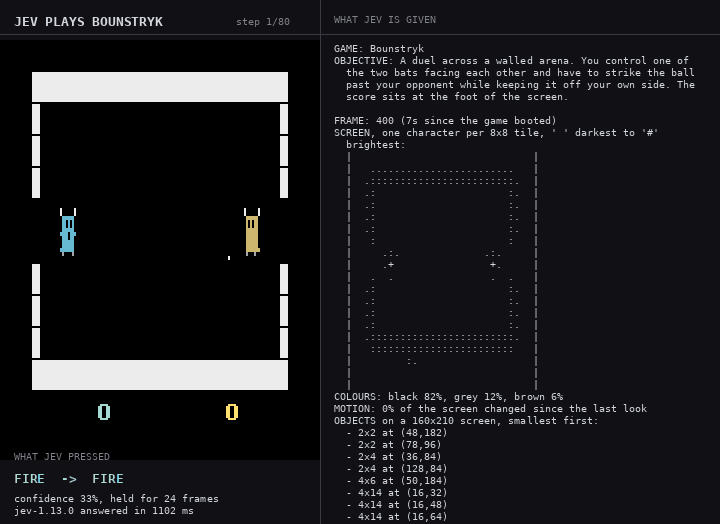
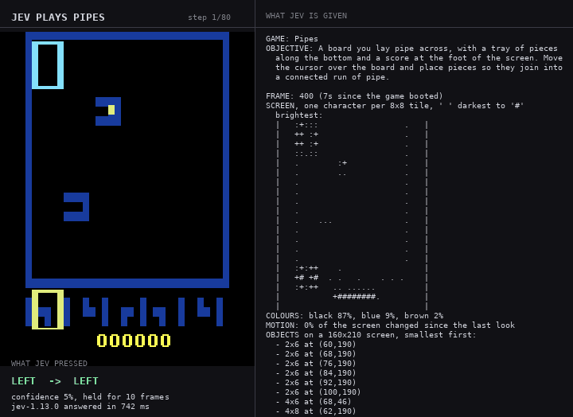
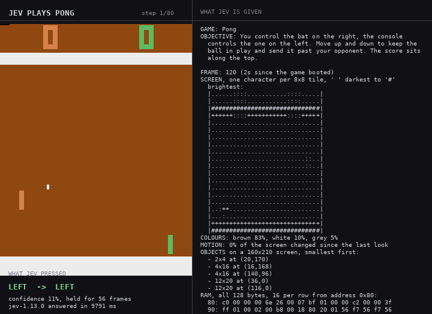
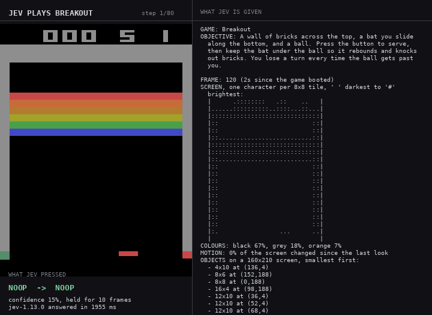

# jev-plays

[Jev](https://docs.typesafe.ai) picks the controller inputs for open Game Boy Advance and
Atari 2600 games running in [mGBA](https://mgba.io) and
[Stella](https://github.com/Farama-Foundation/Arcade-Learning-Environment). Nothing else
decides anything: there is no policy, planner or heuristic in this repository. The
emulator presses whatever Jev answers.

Jev is a System One model — it returns a typed choice, not text — and it has no vision
input, so each frame is described to it as compact text. It answers with a probability
over the buttons and how long to hold one.

## Quick start

```bash
uv venv --python 3.13 .venv
uv pip install -e .                  # includes ale-py, which ships Stella as a wheel
./scripts/build_mgba.sh              # mGBA + its Python bindings (~3 min, not on PyPI)
./scripts/fetch_roms.py              # the ROMs we may legally fetch
cp .env.example .env                 # add your TYPESAFE_API_KEY
jev-plays a2600_freeway --steps 80
```

Only the Game Boy Advance games need `build_mgba.sh`; the Atari ones run straight off the
`ale-py` wheel. Each run writes `runs/<game>-<time>/` with `run.jsonl` (every decision),
`stats.json`, `frames/` and `run.gif`.

## How it works

```
ROM ──► emulator ──► observer ──► compact text ──► Jev ──► choice + hold ──► buttons ──┐
        │            │                                     ▲                           │
   emulator/gba.py   emulator/observe.py             jev/player.py                      │
   emulator/atari.py + games/<game>/ (optional)                                         │
        ▲                                                                               │
        └───────────────────────────────────────────────────────────────────────────────┘
```

`emulator/` holds one dumb adapter per console. Each loads a ROM, holds inputs and reads
back the frame, plus whatever else the hardware offers: the GBA exposes its sprite table,
the 2600 its whole 128 bytes of RAM.

`emulator/observe.py` turns that into text — a brightness grid at one character per tile,
dominant colours, what moved and where, the objects on screen, and what the last few
inputs did. It is strictly descriptive and imports neither adapter.

`jev/` asks Jev and logs the answer. Each `games/<game>/` supplies only the ROM's
provenance, the objective, the pad vocabulary and an optional game-specific decoder.

Adding a game: drop a `games/<slug>/__init__.py` with a `Game(...)`, add the slug to
`games/__init__.py`. That is the whole change.

## The players

Every run below is 80 decisions. The panel on the right of each GIF is the text Jev was
given; the line under the screen is what it answered. GIFs run at about 1.5× emulated
speed and do not show the wait for Jev's answer.

### Game Boy Advance

| Game | Command | ROM | How far Jev got |
|---|---|---|---|
| [Anguna](#anguna) | `jev-plays anguna` | fetched | into the dungeon, fighting |
| [GBA Tactics](#gba-tactics) | `jev-plays gba_tactics` | fetched | moved a unit, opened its attack range |
| [Skyland](#skyland) | `jev-plays skyland` | fetched | flew the sky map into zone 1 |
| [Solar Guard](#solar-guard) | `jev-plays solar_guard` | fetched | launched a mission, flew it |
| Duster | `jev-plays duster` | you supply `DUSTER_ROM` | not run |
| NucularScience | `jev-plays nucular_science` | you supply `NUCULAR_SCIENCE_ROM` | not run |

#### Anguna

Through the intro and into the first dungeon. 27 starts, 26 no-input, 20 attacks.

#### GBA Tactics

Started a battle and moved a unit — the menu drops from `MOVE/ATTACK/END` to `ATTACK/END`
once a unit has moved.

#### Skyland

Out of the menus, onto the sky map, through a zone-1 encounter.

#### Solar Guard

Cleared the title, picked *Orbit Tidying* off the mission list, flew it.

### Atari 2600

| Game | Command | ROM | How far Jev got |
|---|---|---|---|
| [2048](#2048) | `jev-plays a2600_2048` | fetched | scored 272, merged up to 16 |
| [Freeway](#freeway) | `jev-plays a2600_freeway` | your ale-py | walked the chicken up the road |
| [Space Invaders](#space-invaders) | `jev-plays a2600_space_invaders` | your ale-py | scored 60, thinned the formation |
| [Bounstryk](#bounstryk) | `jev-plays a2600_bounstryk` | fetched | took a point off the console, 1–1 |
| [Pipes](#pipes) | `jev-plays a2600_pipes` | fetched | placed pieces, never completed a run |
| [Pong](#pong) | `jev-plays a2600_pong` | your ale-py | tracked the ball, lost |
| [Breakout](#breakout) | `jev-plays a2600_breakout` | your ale-py | served 5 balls, moved the bat 3 times |

#### 2048

The best fit in the set: turn-based, four inputs, no clock. Score went 4 → 96 → 272.

#### Freeway

41 of 80 inputs were *up*. The chicken reaches the middle lanes and gets knocked back.

#### Space Invaders

Scored 60 and opened gaps in the formation, mostly with `RIGHTFIRE` and `LEFTFIRE`.

#### Bounstryk

Rallied and took a point off the console. Finished 1–1.

#### Pipes

Moved the cursor and placed pieces, but never joined them into a scoring run.

#### Pong

37 of 80 inputs moved the bat, and it tracks the ball — but not fast enough.

#### Breakout

The worst fit. Jev serves, the ball is gone before the next look, and all five balls are
lost in 12 seconds. See below.

## Why the input is drawn, not taken

Jev returns a probability over the buttons. Pressing its single most likely one gets
stuck: on Solar Guard's "Press START" screen, `START` averaged 17% and peaked at 25%, so
it never topped the distribution and was never pressed once in 80 decisions. More steps
cannot help when the argmax is stable.

So the input is drawn in proportion to Jev's own probabilities. The numbers are entirely
Jev's — there is no policy, ranking or veto on this side of the wire, and a draw is not a
decision-maker. `run.jsonl` records the full distribution and `top_action` for every step,
and the terminal marks a draw that differed from the top label with `*`. `--argmax`
restores the deterministic behaviour, `--seed` makes a draw reproducible.

## What the observer has to get right

Jev can only act on what the observer describes, and two bugs here looked exactly like bad
play until they were fixed:

- **Small objects vanished.** Averaging the frame into a brightness grid erased anything
  small — a two-pixel ball contributes almost nothing to its cell's mean. Jev stood still
  in every bat-and-ball game because the picture looked static. Consoles that draw a few
  tiny objects on flat colour now keep the brightest pixel per cell instead, and the 2600
  gets an object list derived from the frame, since it has no sprite table. Pong went from
  11 of 80 inputs moving the bat to 37.
- **Verbs in the labels.** Solar Guard's A button was called `FIRE`, which reads wrong on
  a menu. Buttons are now named after the hardware and the description carries the
  meaning.

What is left is latency, and that is not fixable from this side. At ~320 ms per answer
plus a held input, Jev sees roughly two frames a second. Freeway and 2048 do not care.
Breakout does: the ball crosses the screen between looks, so Jev's observation is almost
always "bat at rest, no ball".

## ROMs and licences

**No ROM is committed here.** RetroBrews states its collection is "approved for free
distribution on this site/project only", so that permission does not travel to this
repository. Each game was checked against its own upstream instead, and
`scripts/fetch_roms.py` downloads only the ones whose licence allows it.

| Game | Licence | Source |
|---|---|---|
| Anguna | Author grants free binary redistribution, with `anguna.txt` | [retrobrews/gba-games](https://github.com/retrobrews/gba-games) — Nathan Tolbert, 2008 |
| GBA Tactics | GPL-2.0-or-later | [retrobrews/gba-games](https://github.com/retrobrews/gba-games) — David Galvez Roca, 2006 |
| Skyland | MPL-2.0 | [evanbowman/skyland-gba](https://github.com/evanbowman/skyland-gba) release 2022.1.7.0 |
| Solar Guard | GPL-3.0-only | [Deft-Spade/Solar-Guard](https://github.com/Deft-Spade/Solar-Guard) release GBA-JAM-2021 |
| 2048 | MIT | [chesterbr/2048-2600](https://github.com/chesterbr/2048-2600) |
| Pipes | MIT | [albf/pipes-2600](https://github.com/albf/pipes-2600) |
| Bounstryk | Apache-2.0 | [egar-garcia/bounstryk](https://github.com/egar-garcia/bounstryk) release v1.0.0 |
| NucularScience | Zlib | [LiquidFenrir/NucularScience](https://github.com/LiquidFenrir/NucularScience) — source only, no published binary |
| Duster | **Unknown** | `bmchtech/duster`, later `redthing1/duster` — both removed from GitHub |
| Breakout, Pong, Space Invaders, Freeway | **Commercial, rights unclear** | shipped inside your own `ale-py` install |

We fetch rather than bundle even where the licence would permit it: the copyleft ROMs
would oblige us to ship corresponding source we do not have.

The four Atari classics are commercial titles. `ale-py` has shipped 108 of them inside its
wheel since v0.9.0 (May 2024) without publishing any permission from the rights holders,
so this repository treats their redistribution status as unclear: nothing here downloads
or ships them, and the runner reads the copy your own install already put on disk. The
same applies to Duster, whose upstream is gone, and NucularScience, which publishes source
but no binary. Any game can also run from a ROM you supply:

```bash
DUSTER_ROM=/path/to/Duster.gba jev-plays duster
```

## Notes

- Latency ran 300–740 ms per decision. Turn-based games fit the loop; action games do not.
- mGBA is built from a pinned 0.10.5 checkout with `scripts/mgba-0.10.5-headless.patch`,
  which only guards e-reader symbols that exist solely in an ffmpeg build.
- ALE refuses ROMs whose MD5 it does not know, so homebrew is handed to it under a name it
  does know. That only selects ALE's scoring rules, which this repository never reads.

The code here is MIT (see `LICENSE`). mGBA is MPL-2.0, ALE is GPL-2.0. The games are under
their own licences, listed above. Built with Claude Code.
