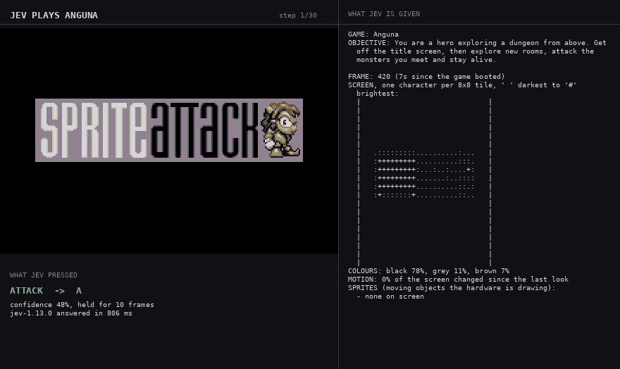
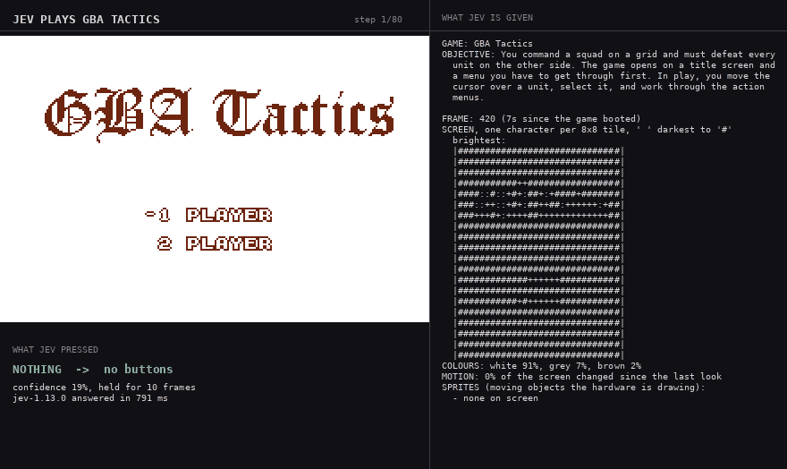
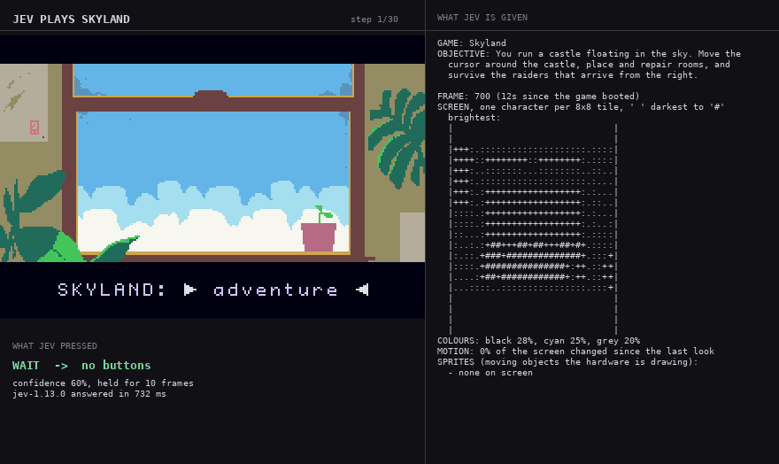
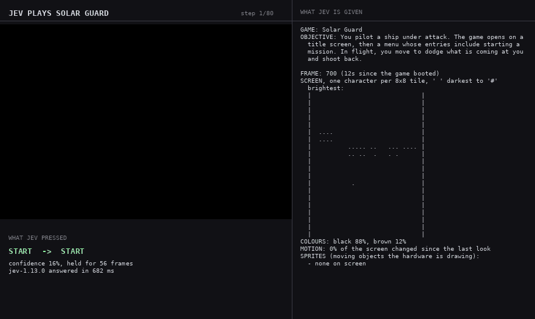

# jev-plays

[Jev](https://docs.typesafe.ai) picks the controller inputs for open-source Game Boy Advance games running in [mGBA](https://mgba.io). Nothing else decides anything: there is no policy, planner or heuristic in this repository. The emulator presses whatever Jev answers.

Jev is a System One model — it returns a typed choice, not text — so each frame is
described to it as compact text and it answers with one button and how long to hold it.

## Quick start

```bash
uv venv --python 3.13 .venv          # 1. a virtualenv
uv pip install -e .                  # 2. the package
./scripts/build_mgba.sh              # 3. mGBA + its Python bindings (~3 min, not on PyPI)
./scripts/fetch_roms.py              # 4. the ROMs we may legally fetch
cp .env.example .env                 # 5. add your TYPESAFE_API_KEY
jev-plays anguna --steps 30
```

Each run writes `runs/<game>-<time>/` with `run.jsonl` (every decision), `stats.json`,
`frames/` and `run.gif`.

## How it works

```
GBA ROM ──► mGBA ──► observer ──► compact text ──► Jev ──► choice + hold ──► buttons ──► mGBA
            │        │                                     ▲                            │
         emulator/   emulator/observe.py                   │                            │
         gba.py      + games/<game>/ (optional decoder)   jev/player.py                 │
            └───────────────────────────────────────────────────────────────────────────┘
```

`emulator/` loads ROMs, holds buttons and reads back the framebuffer, OAM and memory.
`emulator/observe.py` turns that into text — a brightness grid at one character per 8×8
tile, dominant colours, how much moved, the enabled sprites, and what the last few
inputs did. It is strictly descriptive. `jev/` asks Jev and logs the answer. Each
`games/<game>/` supplies only the ROM's provenance, the objective, the pad vocabulary
Jev chooses from, and an optional game-specific decoder.

Adding a game: drop a `games/<slug>/__init__.py` with a `Game(...)`, add the slug to
`games/__init__.py`. That is the whole change.

## The players

The panel on the right of each GIF is the text Jev was given; the line under the screen
is what it answered.

| Game | Command | ROM | 30 decisions |
|---|---|---|---|
| [Anguna](#anguna) | `jev-plays anguna` | fetched | 42% mean confidence, 356 ms |
| [GBA Tactics](#gba-tactics) | `jev-plays gba_tactics` | fetched | 40% mean confidence, 332 ms |
| [Skyland](#skyland) | `jev-plays skyland` | fetched | 65% mean confidence, 322 ms |
| [Solar Guard](#solar-guard) | `jev-plays solar_guard` | fetched | 42% mean confidence, 333 ms |
| Duster | `jev-plays duster` | you supply `DUSTER_ROM` | not run |
| NucularScience | `jev-plays nucular_science` | you supply `NUCULAR_SCIENCE_ROM` | not run |

### Anguna



Jev cleared the title screen, pressed through the whole intro and reached the first
dungeon room. 24 waits, 6 attacks.

### GBA Tactics



Jev started a battle and selected a unit; the last frames show its movement range open.
26 waits, 3 confirms, 1 start.

### Skyland



Jev chose to wait all 30 times, at its highest confidence of any game, and never left
the menu. Pressing A six times does start the game, so this is Jev's answer, not a stuck
loop.

### Solar Guard



Jev reached the main menu and then alternated start and wait for the rest of the run.

## ROMs and licences

**No ROM is committed here.** RetroBrews states its collection is "approved for free
distribution on this site/project only", so that permission does not travel to this
repository. Each game was checked against its own upstream instead, and
`scripts/fetch_roms.py` downloads only the four with a licence that allows it.

| Game | Licence | Source |
|---|---|---|
| Anguna | Author grants free binary redistribution, with `anguna.txt` | [retrobrews/gba-games](https://github.com/retrobrews/gba-games) — Nathan Tolbert, 2008 |
| GBA Tactics | GPL-2.0-or-later | [retrobrews/gba-games](https://github.com/retrobrews/gba-games) — David Galvez Roca, 2006 |
| Skyland | MPL-2.0 | [evanbowman/skyland-gba](https://github.com/evanbowman/skyland-gba) release 2022.1.7.0 |
| Solar Guard | GPL-3.0-only | [Deft-Spade/Solar-Guard](https://github.com/Deft-Spade/Solar-Guard) release GBA-JAM-2021 |
| NucularScience | Zlib | [LiquidFenrir/NucularScience](https://github.com/LiquidFenrir/NucularScience) — source only, no published binary |
| Duster | **Unknown** | `bmchtech/duster`, later `redthing1/duster` — both removed from GitHub |

We fetch rather than bundle even where the licence would permit it: the copyleft ROMs
would oblige us to ship corresponding source we do not have. NucularScience has a
permissive licence but no published build, so build it with butano and devkitARM.
Duster's upstream is gone and no licence survives anywhere we could check, so its
redistribution status is unclear and it is neither fetched nor shipped. Both run from a
ROM you supply:

```bash
DUSTER_ROM=/path/to/Duster.gba jev-plays duster
```

## Notes

- Jev takes text only; there is no vision input, which is why the observer describes the
  frame rather than sending it.
- Latency ran 260–900 ms per decision, so turn-based games fit the loop far better than
  action games.
- mGBA is built from a pinned 0.10.5 checkout with `scripts/mgba-0.10.5-headless.patch`,
  which only guards e-reader symbols that exist solely in an ffmpeg build.

The code here is MIT (see `LICENSE`). mGBA is MPL-2.0. The games are under their own
licences, listed above.
